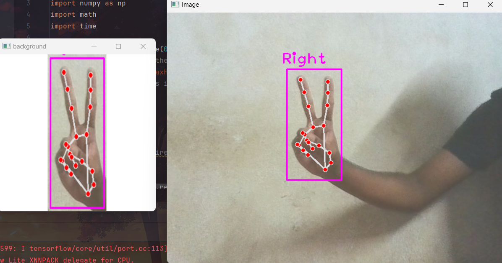

# American Sign Language Detector with Custom Hand Signs


The American Sign Language Detector with Custom Hand Signs is a Python project designed to recognize and interpret American Sign Language gestures in real-time. This project incorporates a machine learning model for gesture recognition and allows users to add and customize their own hand signs.

## Features

- Real-time detection and interpretation of American Sign Language gestures.
- Integration of a machine learning model built with Keras for accurate gesture recognition.
- Utilizes OpenCV for image processing and real-time video capture.
- Ability to add and customize new hand signs according to user preferences.
- Simple and intuitive user interface for ease of use.

## Technologies Used

- Python
- OpenCV
- Machine Learning (TensorFlow)
- Keras
- NumPy
- SciPy

## Installation

1. Clone the repository:

```
git clone https://github.com/18Aswin/American-Sign-Language-Detector.git
```

2. Run the application:

```
python main.py
```

## Usage

1. Launch the application by running `main.py`.
2. Position your hand in front of the camera and make a sign.
3. The application will detect and interpret the sign in real-time.
4. Optionally, add and customize new hand signs using the provided interface.

## Contributions

Contributions are welcome! If you have any ideas, suggestions, or improvements, feel free to open an issue or create a pull request.

## About

The American Sign Language Detector with Custom Hand Signs is developed and maintained by Aswin A Nair. Feel free to reach out with any questions or feedback.

---

Start communicating with American Sign Language more effectively with the ASL Detector! If you have any questions or encounter any issues, don't hesitate to reach out.
